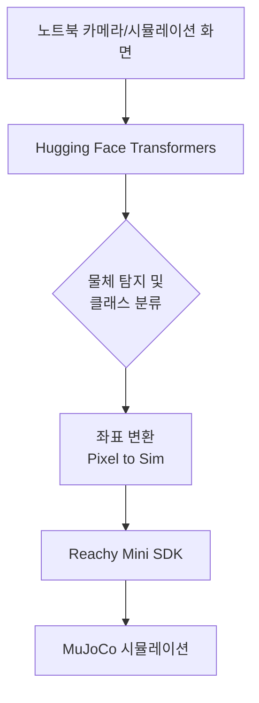

# Week 08: Hugging Face 비전 모델 연동 (시뮬레이션 환경)

## 학습 목표

- Hugging Face `transformers` 라이브러리를 이용한 비전 모델 활용
- **DETR(Detection Transformer)**를 이용한 시뮬레이션 내 물체 탐지
- **OWL-ViT**를 이용한 제로샷(Zero-shot) 물체 인식 및 추적
- 비전 모델의 인식 결과와 Reachy Mini 시뮬레이션 동작 통합

---

## 1. 개요

이번 주차에서는 전통적인 OpenCV 기반 방식을 넘어, **Hugging Face**에서 제공하는 최신 딥러닝 비전 모델을 Reachy Mini 시뮬레이션에 적용합니다. 특히 트랜스포머 기반의 모델을 사용하여 시뮬레이션 환경 내의 다양한 물체를 인식하고 로봇이 반응하도록 구현합니다.

### 시스템 아키텍처



---

## 2. 환경 설정

### 2.1 필수 패키지 설치

Hugging Face 모델을 실행하기 위한 라이브러리를 설치합니다:

```bash
# 가상환경 활성화
.venv\Scripts\activate

# 필요 라이브러리 설치
uv pip install transformers torch torchvision pillow gradio_client sounddevice soundfile
```

### 2.2 GPU 가속 확인 (선택 사항)

NVIDIA GPU가 있는 경우 CUDA를 사용하면 훨씬 빠른 추론이 가능합니다:

```python
import torch
print(f"CUDA 사용 가능 여부: {torch.cuda.is_available()}")
```

### 2.3 Hugging Face Hub 활용 방법

허깅페이스는 다양한 모델을 쉽게 사용할 수 있도록 높은 수준의 API를 제공합니다.

#### A. Pipeline API (가장 쉬움)
단 몇 줄의 코드로 모델을 실행할 수 있습니다. 전처리와 후처리가 내부적으로 수행됩니다.

```python
from transformers import pipeline

# 물체 탐지(object-detection) 태스크의 특정 모델을 로드
detector = pipeline("object-detection", model="facebook/detr-resnet-50")
results = detector("image_path.jpg")
```

#### B. AutoModel & AutoProcessor (세밀한 제어)
데이터 전처리(Processor)와 추론 엔진(Model)을 분리하여 제어할 때 사용합니다. 본 교육 과정에서 주로 사용하는 방식입니다.

```python
from transformers import AutoProcessor, AutoModelForObjectDetection

model_id = "facebook/detr-resnet-50"
processor = AutoProcessor.from_pretrained(model_id)
model = AutoModelForObjectDetection.from_pretrained(model_id)
```

### 2.4 Hugging Face Inference API (서버리스)

로컬 컴퓨터의 사양이 낮거나, 모델을 다운로드하지 않고 결과를 바로 확인하고 싶을 때 허깅페이스에서 제공하는 클라우드 API를 사용합니다.

#### API 호출 예시 (Python)

```python
# pip install huggingface_hub
from huggingface_hub import InferenceClient

# 토큰은 https://huggingface.co/settings/tokens 에서 발급
client = InferenceClient(api_key="hf_your_token_here")

# 원격 서버에서 추론 실행
results = client.object_detection(
    "image_path.jpg", 
    model="facebook/detr-resnet-50"
)

for result in results:
    print(f"Label: {result.label}, Score: {result.score:.2f}")
```

#### B. 음성 출력(TTS) 및 자동 재생 (Spaces 활용)

가장 안정적인 무료 고품질 TTS를 위해 Hugging Face Spaces의 `MeloTTS` 모델을 **Gradio Client**를 통해 활용합니다. 또한 `sounddevice`를 사용해 즉시 재생하는 기능을 포함합니다.

```python
import os
import shutil
import sounddevice as sd
import soundfile as sf
from gradio_client import Client

# 1. 허깅페이스 API 토큰 설정 (https://huggingface.co/settings/tokens)
HF_TOKEN = os.getenv("HF_TOKEN", "your_token_here")

def play_sound(file_path):
    """사운드 파일 재생"""
    try:
        data, fs = sf.read(file_path)
        sd.play(data, fs)
        sd.wait()  # 재생 완료 대기
    except Exception as e:
        print(f"재생 오류: {e}")

def generate_speech(text, output_file="output.wav", language="EN", play=True):
    """Hugging Face Spaces의 MeloTTS 활용"""
    print(f"변환 중 (MeloTTS via Gradio): '{text}'")
    
    try:
        # Gradio Client 연결
        client = Client("mrfakename/MeloTTS", token=HF_TOKEN)
        
        # API 호출 (언어 설정 가능: 'EN', 'KR', 'JP' 등)
        result = client.predict(
            text=text,
            speaker="EN-Default",
            speed=1.0,
            language=language,
            api_name="/synthesize"
        )
        
        # 결과 저장 및 재생
        shutil.copy(result, output_file)
        print(f"성공! 저장됨: {output_file}")
        
        if play:
            play_sound(output_file)
            
    except Exception as e:
        print(f"오류 발생: {e}")

if __name__ == "__main__":
    generate_speech("Hello, I am Reachy-mini. Nice to meet you.")
```

> [!NOTE]
> 표준 Inference API는 무료 레이어에서 TTS 엔드포인트가 불안정할 수 있으므로, 위와 같이 Spaces의 Gradio API를 사용하는 것이 가장 확실한 방법입니다.

---

## 3. DETR을 이용한 물체 탐지

**DETR (DEtection TRansformer)**은 페이스북 AI 리서치(FAIR)에서 발표한 모델로, 기존의 복잡한 핸드크래프트 방식(NMS, Anchor Boxes 등)을 제거하고 **트랜스포머 아키텍처를 물체 탐지에 직접적으로 적용**한 최초의 모델입니다.

### 3.1 DETR의 핵심 구조

1.  **Backbone**: ResNet과 같은 CNN을 사용하여 이미지의 특징 맵(Feature Map)을 추출합니다.
2.  **Transformer Encoder**: CNN에서 나온 특징들에 위치 정보(Positional Encoding)를 더해 이미지 전체의 문맥 정보를 파악합니다.
3.  **Transformer Decoder**: **'Object Queries'**라는 고정된 개수의 학습 가능한 벡터를 입력받아, 이미지 내 어디에 어떤 물체가 있는지 찾아냅니다.
4.  **Prediction Heads**: 각 쿼리에 대해 물체의 클래스와 위치(Bounding Box)를 예측합니다.
5.  **Bipartite Matching Loss**: 예측된 결과와 실제 정답(Ground Truth) 사이의 중복 없는 일대일 매칭을 수행하여 NMS 없이도 중복된 탐지를 방지합니다.

### 3.1 기본 추론 코드

```python
import torch
from transformers import DetrImageProcessor, DetrForObjectDetection
from PIL import Image
import cv2
import numpy as np

# 모델 및 프로세서 로드
processor = DetrImageProcessor.from_pretrained("facebook/detr-resnet-50")
model = DetrForObjectDetection.from_pretrained("facebook/detr-resnet-50")

def detect_objects(frame):
    # OpenCV 프레임(BGR)을 PIL 이미지(RGB)로 변환
    image = Image.fromarray(cv2.cvtColor(frame, cv2.COLOR_BGR2RGB))
    
    # 전처리 및 추론
    inputs = processor(images=image, return_tensors="pt")
    outputs = model(**inputs)
    
    # 결과 해석 (임계값 0.9 이상만)
    target_sizes = torch.tensor([image.size[::-1]])
    results = processor.post_process_object_detection(outputs, target_sizes=target_sizes, threshold=0.9)[0]
    
    return results

# 웹캠 테스트
cap = cv2.VideoCapture(0)
while True:
    ret, frame = cap.read()
    if not ret: break
    
    results = detect_objects(frame)
    
    for score, label, box in zip(results["scores"], results["labels"], results["boxes"]):
        box = [int(i) for i in box.tolist()]
        label_name = model.config.id2label[label.item()]
        
        # 화면에 그리기
        cv2.rectangle(frame, (box[0], box[1]), (box[2], box[3]), (0, 255, 0), 2)
        cv2.putText(frame, f"{label_name}: {score:.2f}", (box[0], box[1]-10),
                    cv2.FONT_HERSHEY_SIMPLEX, 0.5, (0, 255, 0), 2)
    
    cv2.imshow("DETR Detection", frame)
    if cv2.waitKey(1) & 0xFF == ord('q'): break

cap.release()
cv2.destroyAllWindows()
```

---

## 4. OWL-ViT: 제로샷 물체 탐지

**OWL-ViT (Open-World Object Detection)**는 구글에서 발표한 모델로, 학습 단계에서 보지 못한 새로운 카테고리에 대해서도 텍스트 설명만으로 물체를 찾아낼 수 있는 **제로샷(Zero-shot)** 탐지 모델입니다.

### 4.1 OWL-ViT의 특징

-   **Vision + Text 결합**: 이미지의 시각적 특징과 텍스트의 언어적 특징을 결합하여 인식합니다. (CLIP과 유사한 방식)
-   **Open-World**: "bottle", "cup"처럼 미리 정의된 클래스뿐만 아니라 "a person wearing a red shirt"와 같이 구체적인 묘사로도 물체를 찾을 수 있습니다.
-   **ViT Backbone**: Vision Transformer 아키텍처를 사용하여 이미지의 글로벌한 관계를 잘 파악합니다.

### 4.1 특정 물체 추적 및 시뮬레이션 연동

```python
from transformers import Owlv2Processor, Owlv2ForObjectDetection
from reachy_mini import ReachyMini
# ... (생략된 임포트)

# 모델 로드 (Owlv2가 더 빠르고 성능이 좋음)
processor = Owlv2Processor.from_pretrained("google/owlv2-base-patch16-ensemble")
model = Owlv2ForObjectDetection.from_pretrained("google/owlv2-base-patch16-ensemble")

reachy = ReachyMini()
texts = [["a cup", "a bottle", "a person"]]

# 추론 및 로봇 제어 루프 (의사 코드)
# 1. 시뮬레이션/카메라 프레임 캡처
# 2. inputs = processor(text=texts, images=image, return_tensors="pt")
# 3. outputs = model(**inputs)
# 4. 탐지된 'cup'의 중심 좌표 계산
# 5. reachy.head.look_at(x=target_x, y=target_y, z=target_z)
```

---

## 5. 시뮬레이션 통합 실전 (Example 8-1)

시뮬레이션 내의 특정 물체를 인식하고 Reachy Mini가 이를 계속 따라가도록(Tracking) 구현하는 코드입니다.

```python
import cv2
import torch
from PIL import Image
from transformers import DetrImageProcessor, DetrForObjectDetection
from reachy_mini import ReachyMini

# 1. 초기화
reachy = ReachyMini()
processor = DetrImageProcessor.from_pretrained("facebook/detr-resnet-50")
model = DetrForObjectDetection.from_pretrained("facebook/detr-resnet-50")
cap = cv2.VideoCapture(0)

print("특정 물체(예: bottle)를 추적합니다.")

try:
    while True:
        ret, frame = cap.read()
        if not ret: continue
        
        # 2. 물체 탐지
        image = Image.fromarray(cv2.cvtColor(frame, cv2.COLOR_BGR2RGB))
        inputs = processor(images=image, return_tensors="pt")
        outputs = model(**inputs)
        
        target_sizes = torch.tensor([image.size[::-1]])
        results = processor.post_process_object_detection(outputs, target_sizes=target_sizes, threshold=0.8)[0]
        
        for score, label, box in zip(results["scores"], results["labels"], results["boxes"]):
            label_name = model.config.id2label[label.item()]
            
            # 3. 'bottle' 또는 'cup'인 경우에만 반응
            if label_name in ['bottle', 'cup', 'cell phone']:
                box = box.tolist()
                center_x = (box[0] + box[2]) / 2
                center_y = (box[1] + box[3]) / 2
                
                # 화면 중심 대비 상대 좌표 (-0.5 ~ 0.5)
                img_h, img_w = frame.shape[:2]
                offset_x = (center_x - img_w/2) / img_w
                offset_y = (center_y - img_h/2) / img_h
                
                # 4. 시뮬레이션 로봇 제어
                # 화면 좌우(offset_x) -> 로봇 Y축, 화면 상하(offset_y) -> 로봇 Z축
                reachy.head.look_at(x=0.5, y=-offset_x*0.4, z=-offset_y*0.3 + 0.3, duration=0.2)
                
                # 가시화
                cv2.rectangle(frame, (int(box[0]), int(box[1])), (int(box[2]), int(box[3])), (255, 0, 0), 2)
                break # 첫 번째 일치하는 물체만 추적
                
        cv2.imshow("Reachy Vision Integration", frame)
        if cv2.waitKey(1) & 0xFF == ord('q'): break

finally:
    cap.release()
    cv2.destroyAllWindows()
```

---

## 6. 성능 최적화 팁

Hugging Face 모델은 성능이 좋지만 무거울 수 있습니다. 시뮬레이션 연동 시 다음 사항을 고려하세요:

1.  **Frame Skipping**: 매 프레임마다 AI 추론을 하지 않고 3~5프레임마다 한 번씩 수행합니다.
2.  **Resolution Downscaling**: 모델 입력 전 이미지 크기를 320x240 등으로 줄여서 처리 속도를 높입니다.
3.  **Quantization (양자화)**: `torch.quantization`을 사용하여 모델 크기를 줄이고 속도를 높일 수 있습니다. (CPU 환경에서 유용)
4.  **Half Precision**: GPU 사용 시 `model.half()`를 사용하여 FP16 연산을 수행하면 속도가 2배 빨라집니다.

---

## 7. 실습 과제

### 과제 1: OWL-ViT를 이용한 "사과" 찾기
OWL-ViT 모델을 설정하고, "a red apple"이라는 텍스트 쿼리를 통해 시뮬레이션 환경 내의 사과를 찾아 로봇이 가리키도록 구현하세요.

### 과제 2: 물체 탐지 기반 동작 조건부 실행
특정 물체(예: 'stop sign' 또는 'cup')가 인식되면 로봇이 고개를 끄덕이거나 손을 흔드는 동작을 실행하도록 하세요.

---

## 8. 참고 자료

- [Hugging Face Vision Guide](https://huggingface.co/docs/transformers/tasks/object_detection)
- [OWL-ViT Documentation](https://huggingface.co/docs/transformers/model_doc/owlvit)
- [PyTorch CUDA Guide](https://pytorch.org/docs/stable/notes/cuda.html)

---

**작성일**: 2025-02-07  
**환경**: Windows + MuJoCo 시뮬레이션 + Hugging Face Transformers  
**관련 리포지토리**: https://github.com/orocapangyo/reachy_mini
